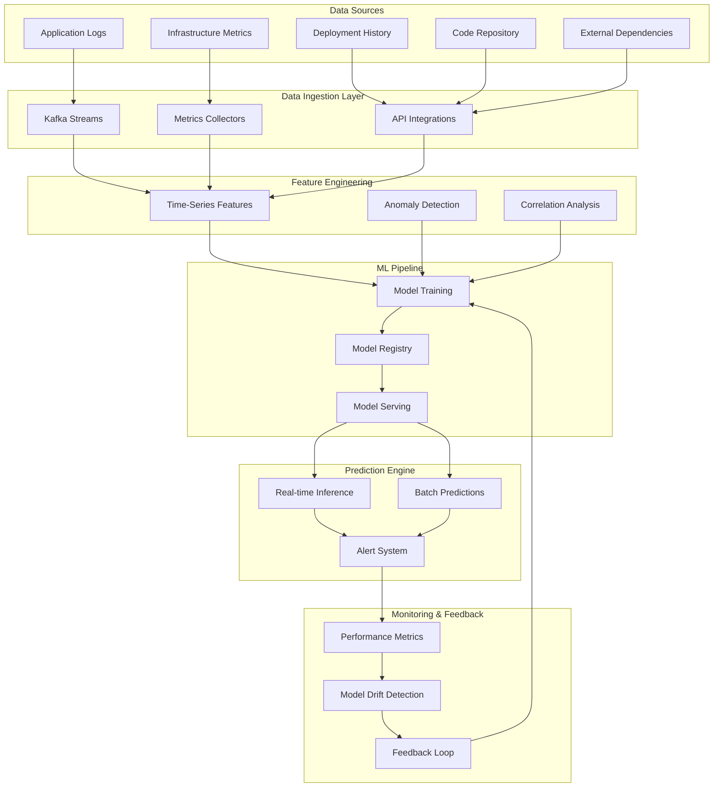
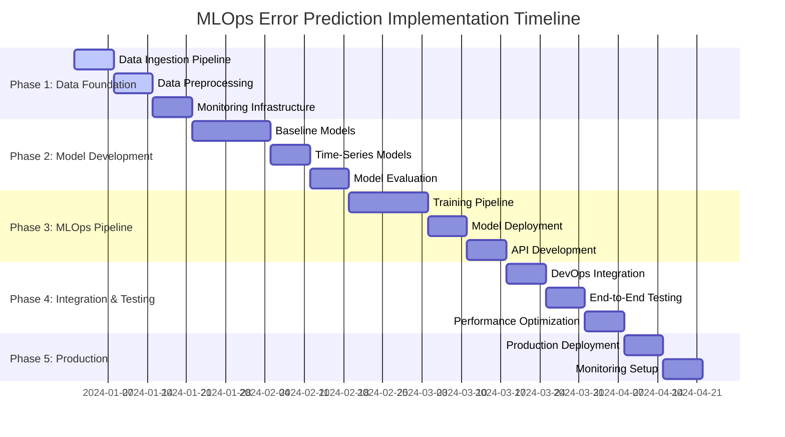
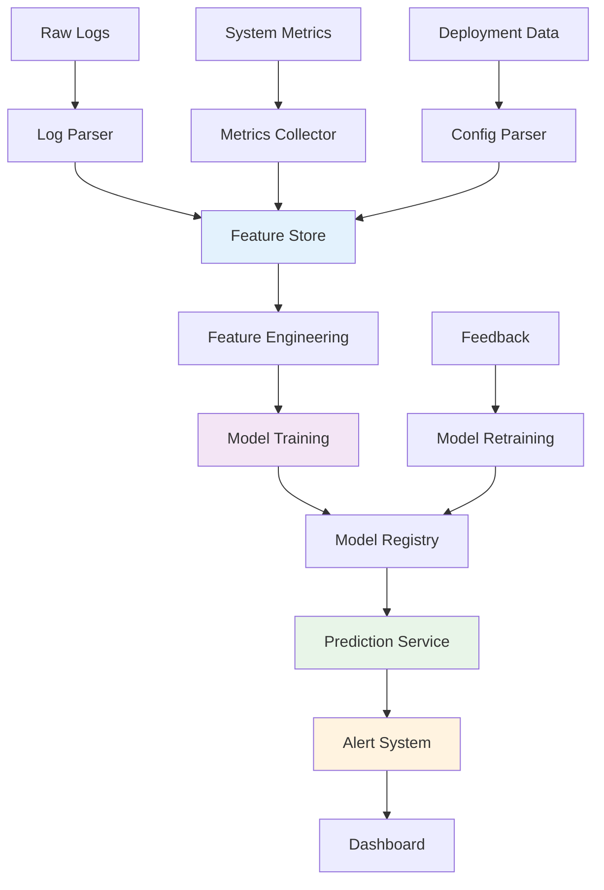

# MLOps Future Error Prediction System

<div align="center">


**🔮 Predict DevOps failures before they happen**

</div>

## 🎯 Project Overview

An intelligent MLOps pipeline that predicts potential errors and failures in development/DevOps environments before they occur, enabling proactive issue resolution and system optimization.

## 🚨 Problem Statement

Development and DevOps teams face recurring challenges with:
- System failures that could be prevented
- Deployment issues causing downtime
- Infrastructure problems affecting productivity
- Reactive instead of proactive problem-solving

This system analyzes historical patterns, system metrics, and environmental factors to forecast potential issues.

## 🏗️ System Architecture



## 🔄 MLOps Workflow

```mermaid
graph LR
    subgraph "Development"
        A[Data Collection] --> B[Feature Engineering]
        B --> C[Model Development]
        C --> D[Model Training]
    end
    
    subgraph "Testing"
        D --> E[Model Validation]
        E --> F[Integration Testing]
        F --> G[Performance Testing]
    end
    
    subgraph "Deployment"
        G --> H[Model Deployment]
        H --> I[API Endpoints]
        I --> J[Production Serving]
    end
    
    subgraph "Monitoring"
        J --> K[Performance Monitoring]
        K --> L[Model Drift Detection]
        L --> M[Alert Generation]
    end
    
    subgraph "Feedback"
        M --> N[Feedback Collection]
        N --> O[Model Retraining]
        O --> D
    end
    
    style A fill:#e1f5fe
    style D fill:#f3e5f5
    style H fill:#e8f5e8
    style K fill:#fff3e0
    style O fill:#fce4ec
```



## 🚀 Features

- **🔍 Error Pattern Recognition**: Analyze historical logs and identify failure patterns
- **📊 Infrastructure Health Monitoring**: Predict resource bottlenecks and system failures
- **⚠️ Deployment Risk Assessment**: Evaluate deployment success probability
- **🎯 Alert Prioritization**: Rank potential issues by severity and likelihood
- **🤖 Automated Recommendations**: Suggest preventive actions

## 🛠️ Technology Stack

### Core ML/Data Stack
- **Python** - Primary development language
- **scikit-learn** - Classical ML algorithms
- **XGBoost/LightGBM** - Gradient boosting models
- **TensorFlow/PyTorch** - Deep learning for time-series
- **MLflow** - Experiment tracking and model registry

### Data Processing
- **Apache Kafka** - Real-time data streaming
- **Apache Airflow** - Workflow orchestration
- **Pandas/Polars** - Data manipulation
- **Apache Spark** - Large-scale data processing

### Infrastructure & DevOps
- **Docker** - Containerization
- **Kubernetes** - Container orchestration
- **Prometheus/Grafana** - Monitoring and visualization
- **ELK Stack** - Log aggregation and analysis
- **Git/GitLab CI** - Version control and CI/CD

### Cloud Services
- **AWS**: SageMaker, Lambda, S3, CloudWatch
- **Google Cloud**: Vertex AI, Cloud Functions, BigQuery
- **Azure**: ML Studio, Functions, Log Analytics

## 📁 Project Structure

```
mlops-error-prediction/
├── 📂 data/
│   ├── 📂 raw/                    # Raw data files
│   ├── 📂 processed/              # Processed datasets
│   └── 📂 external/               # External data sources
├── 📂 src/
│   ├── 📂 data/
│   │   ├── 🐍 ingestion.py        # Data ingestion pipeline
│   │   └── 🐍 preprocessing.py    # Data preprocessing
│   ├── 📂 features/
│   │   ├── 🐍 engineering.py      # Feature engineering
│   │   └── 🐍 selection.py        # Feature selection
│   ├── 📂 models/
│   │   ├── 🐍 training.py         # Model training
│   │   ├── 🐍 prediction.py       # Prediction engine
│   │   └── 🐍 evaluation.py       # Model evaluation
│   └── 📂 api/
│       ├── 🐍 app.py              # FastAPI application
│       └── 🐍 endpoints.py        # API endpoints
├── 📂 notebooks/                  # Jupyter notebooks
├── 📂 tests/                      # Unit and integration tests
├── 📂 config/                     # Configuration files
├── 📂 docker/                     # Docker configurations
├── 📂 k8s/                        # Kubernetes manifests
├── 📂 monitoring/                 # Monitoring configs
├── 📂 docs/                       # Documentation
├── 📄 requirements.txt            # Python dependencies
├── 📄 Dockerfile                  # Docker configuration
├── 📄 docker-compose.yml          # Local development setup
└── 📄 README.md                   # This file
```

## 📅 Implementation Timeline



## 🤖 Key Models and Algorithms

### Time-Series Forecasting
- **ARIMA/SARIMA** - Traditional time-series models
- **LSTM/GRU** - Deep learning for sequential patterns
- **Prophet** - Facebook's forecasting tool for trend analysis

### Classification Models
- **Random Forest** - Error type classification
- **XGBoost** - High-performance gradient boosting
- **Neural Networks** - Complex pattern recognition

### Anomaly Detection
- **Isolation Forest** - Unsupervised anomaly detection
- **One-Class SVM** - Outlier detection
- **Autoencoders** - Deep learning anomaly detection

## 📊 Success Metrics

- **🎯 Prediction Accuracy**: False positive/negative rates < 5%
- **⏰ Early Warning Time**: Predict errors 30+ minutes in advance
- **📉 Downtime Reduction**: 40% decrease in system failures
- **🚨 Alert Relevance**: 90%+ actionable alerts
- **⚡ Model Performance**: <100ms inference latency

## 🛡️ Risk Mitigation

- **Data Quality**: Automated validation and cleaning pipelines
- **Model Drift**: Continuous monitoring and retraining
- **Scalability**: Horizontal scaling architecture
- **Security**: Encrypted data handling and secure APIs
- **Fallback Systems**: Manual override capabilities

## 🚀 Quick Start

### Prerequisites
- Python 3.8+
- Docker and Docker Compose
- Access to log aggregation systems
- Kubernetes cluster (optional)

### Installation

1. **Clone the repository**
```bash
git clone https://github.com/your-username/mlops-error-prediction.git
cd mlops-error-prediction
```

2. **Set up environment**
```bash
python -m venv venv
source venv/bin/activate  # On Windows: venv\Scripts\activate
pip install -r requirements.txt
```

3. **Configure data sources**
```bash
cp config/config.example.yaml config/config.yaml
# Edit config.yaml with your settings
```

4. **Start local development environment**
```bash
docker-compose up -d
```

5. **Run initial data pipeline**
```bash
python src/data/ingestion.py
python src/features/engineering.py
```

6. **Train your first model**
```bash
python src/models/training.py
```

7. **Start the API server**
```bash
uvicorn src.api.app:app --reload
```

Visit `http://localhost:8000/docs` to explore the API documentation.

## 🔄 Data Flow Pipeline



## 📚 Documentation

- [📖 Data Pipeline Documentation](docs/data-pipeline.md)
- [🧠 Model Development Guide](docs/model-development.md)
- [🔌 API Reference](docs/api-reference.md)
- [🚀 Deployment Guide](docs/deployment.md)
- [📊 Monitoring Guide](docs/monitoring.md)

## 🧪 Testing

Run the test suite:
```bash
# Unit tests
pytest tests/unit/

# Integration tests
pytest tests/integration/

# End-to-end tests
pytest tests/e2e/

# All tests with coverage
pytest --cov=src tests/
```

## 🤝 Contributing

We welcome contributions! Please see our [Contributing Guide](CONTRIBUTING.md) for details.

1. Fork the repository
2. Create a feature branch (`git checkout -b feature/amazing-feature`)
3. Commit your changes (`git commit -m 'Add amazing feature'`)
4. Push to the branch (`git push origin feature/amazing-feature`)
5. Open a Pull Request

## 📄 License

This project is licensed under the MIT License - see the [LICENSE](LICENSE) file for details.

## 🙏 Acknowledgments

- [MLflow](https://mlflow.org/) for experiment tracking
- [Apache Kafka](https://kafka.apache.org/) for real-time streaming
- [Prometheus](https://prometheus.io/) for monitoring
- [FastAPI](https://fastapi.tiangolo.com/) for API development

## 📞 Support

- 📧 Email: nathannathan42242@gmail.com
- 💬 Slack: #mlops-error-prediction
- 🐛 Issues:

---

<div align="center">

**⭐ Star this repository if you find it helpful!**

Made with ❤️ by the MLOps Team

</div>
